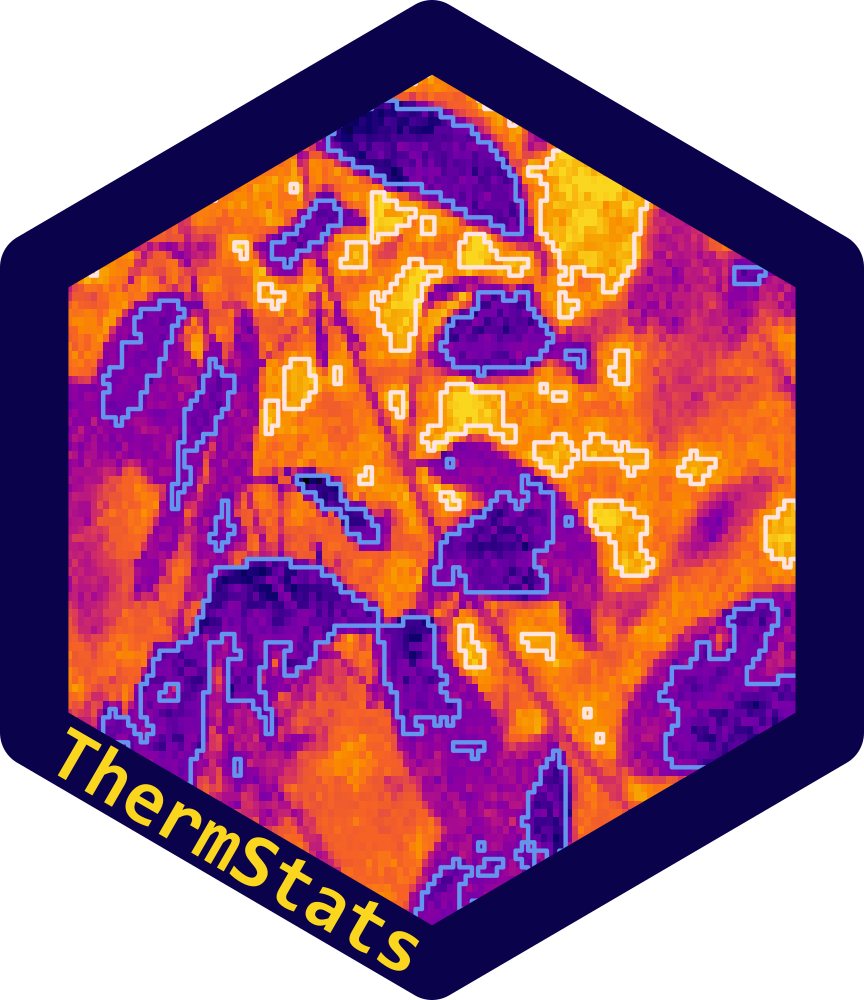

# ThermStats_ms 

All the files and data needed to build manuscript describing the ThermStats package: "`ThermStats`: an `R` package for quantifying surface thermal heterogeneity in assessments of microclimates".

Build using either the knit button in RStudio or `rmarkdown::render("SeniorRA_thermstats_ms.Rmd", output_format = "bookdown::word_document2")`

The manuscript used `ThermStats` version 0.9.3, available on Zenodo:  
