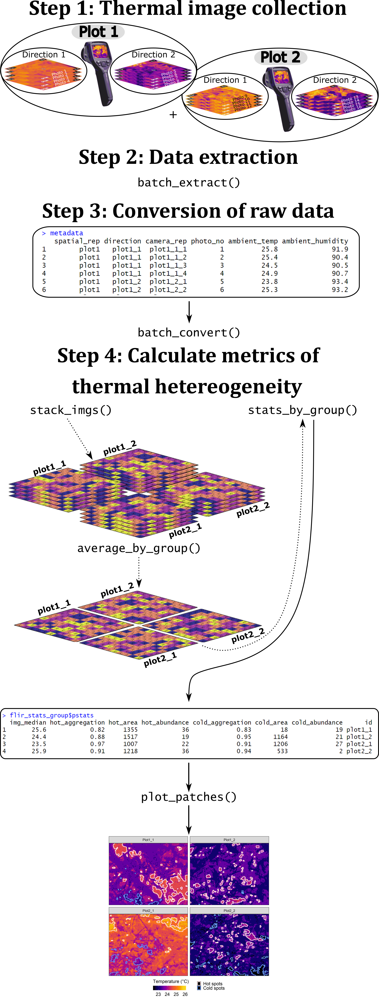

```{r setup, include=FALSE}
knitr::opts_chunk$set(echo = FALSE,message = FALSE,error = FALSE, warning = FALSE, 
                      dpi = 800, fig.path = "./figures/main/")
```

```{r setup-other, include=FALSE}
# Function to require and install packages where necessary
using <- function(...) {
  libs <- unlist(list(...))
  req <- unlist(lapply(libs, require, character.only = TRUE))
  need <- libs[req == FALSE]
  if (length(need) > 0) { 
    install.packages(need)
    lapply(need,require,character.only = TRUE)
  }
}

# Load/install ThermStats from GitHub
if (!(require("ThermStats", character.only = TRUE))) {
  devtools::install_github("rasenior/ThermStats")
}
library(ThermStats)
library(HatchedPolygons)

# Load/install other necessary packages
using("dplyr", "ggmap", "viridis", "ggpubr", "egg")

# Tidy time function
tidy_hour <- function(hour, separator = ":"){
  if (nchar(hour) == 2) {
    return(paste(hour,separator, "00", sep = ""))  
  }else if (nchar(hour == 1)) {
    return(paste("0",hour,separator, "00", sep = ""))
  }else message("Invalid hour")
}

# Colourblind-friendly palette 
# (from http://www.cookbook-r.com/Graphs/Colors_(ggplot2)/)
cbPalette <- c("#999999", "#E69F00", "#56B4E9", "#009E73", "#F0E442",
               "#0072B2", "#D55E00", "#CC79A7")

# Plotting parameters
title_size <- 10
title_size_lattice <- 0.8
text_size <- 8
text_size_lattice <- 0.6
lab_size <- 10
lab_size_lattice <- 0.8
```

```{r load-data, include = FALSE}

# Figure 2 ---------------------------------------------------------------------
flir_example <- readRDS("data/flir_patch_example.Rds")
# Example output from get_stats

worldclim_example <- readRDS("data/worldclim_patches_example.Rds")
# Example output from get_stats

worldlcim_bg <- readRDS("data/borneo_outline.Rds")
# Outline of Borneo

# Figure 3 ---------------------------------------------------------------------
load("data/flir_stats.Rdata")
# flir_dat = statistics for FLIR images in primary & logged forests in Borneo
# flir_pred = model-predicted values
# flir_results_sum = results from analyses of FLIR images

# Get significance level of FLIR results
flir_sig <-
  flir_results_sum %>% 
  filter(dropped_EV == "s(day_mins, fx = FALSE, k=-1, bs = 'cr')") %>%
  dplyr::select(sig) %>% 
  na.omit(flir_sig)

# Figure 4-- -------------------------------------------------------------------
flir_group_avg <- readRDS("data/flirstack_avg.Rds")
# Raster stack produced by average_by_group

# Figure 5 ---------------------------------------------------------------------
load("data/lidar_map.Rdata")
# lidar_boundary = outline of the study area
# lidar_ras = dataframe of LIDAR temperature data (converted from raster)
# op = outline of oil palm plantation
# op_hatch = hatching of oil palm plantation
# lidar_bg = ggmap with satellite basemap for the study area

lidar_stats <- readRDS("data/lidar_stats.Rds")
# Results from stats_by_group

# Get bounding box of satellite basemap
bg_bb <- attr(lidar_bg, "bb")
```

_______________________________________________________________________________________

Rebecca A. Senior^1^*&sect;, Jane K. Hill^2^ and David P. Edwards^1^

^1^Department of Animal and Plant Sciences, Alfred Denny Building, University of Sheffield, Western Bank, Sheffield, S10 2TN, UK

^2^Department of Biology, University of York, Wentworth Way, York, YO10 5DD, UK

*__Corresponding author:__ rebecca.a.senior@gmail.com, +44(0)114 2220123 (R.A. Senior)

&sect; Present address: Woodrow Wilson School of Public and International Affairs, Princeton University, Princeton, New Jersey 08544 USA

__ORCID iDs:__ 0000-0002-8208-736X (R.A. Senior); 0000-0003-1871-7715 (J.K. Hill); 0000-0001-8562-3853 (D.P. Edwards)

__Key words:__ infrared; microclimate; temperature; thermal camera; thermography; thermoregulation.

__Type of paper:__ Application

# Abstract

1. Variation in temperature at a fine spatial scale creates critically important microclimates for many organisms. Quantifying thermal heterogeneity at this scale is challenging and, until recently, has been largely restricted to the use of dataloggers to record air temperature. Thermography is becoming an increasingly viable alternative. A single photo from a thermal imaging camera contains thousands of spatially explicit surface temperature measurements, making thermal cameras ideal for rapidly assessing temperature variation at fine scale.

2. Here, we present an `R` package -- `ThermStats` -- for processing thermal images and other gridded temperature data. The package addresses current constraints on applying thermography in ecology, by speeding up and simplifying the extraction of data from thermal images, and by facilitating the calculation of different metrics of thermal heterogeneity. The metrics capture both the frequency distribution and spatial patterns of temperature, and the package functions are designed to accommodate different sampling strategies and data in either matrix or raster format.

3. We demonstrate how `ThermStats` can be used to capture temperature variation at fine spatial scales in structurally complex habitat, such as tropical rainforest. Using thermal images collected in the field (~0.5 cm^2^ resolution), we found that thermal hetereogeneity varied little between primary and logged forest, but did vary with time of day. Comparing temperature extremes in a microclimate layer estimated from LIght Detection And Ranging (LIDAR) data (2,500 m^2^ resolution), we found that both hot and cold extremes were hotter inside oil palm plantations than in the neighbouring forest.

4. Our package simplifies the processing of thermal data, and our metrics capture key spatiotemporal temperature trends that underpin physiological, behavioural and demographic responses to environmental change. As such, `ThermStats` can advance a wide range of studies requiring fine-scale surface temperature data for microclimate investigations.

# Introduction

Temperature variation over spatial scales of mm to m has a central role in the ecology of many species. For small organisms, this is the scale at which nearly all thermal experiences will occur [@potter_microclimatic_2013]. Mobile species utilise fine-scale thermal heterogeneity on a daily basis to avoid or exploit extremes of heat. Over longer time periods, climate at this scale ('microclimate') can also maximise fitness and thus influence the fine-scale distribution of less mobile species [@maclean_fine-scale_2017]. Species can persist within 'microrefugia' where climatic conditions are otherwise unsuitable, potentially maintaining higher overall biodiversity in thermally heterogenous habitats [@hannah_fine-grain_2014]. The same mechanisms underlying fine-scale thermoregulation and thermal microrefugia could temper species' exposure to global climate change [@suggitt_extinction_2018; @scheffers_microhabitats_2014], especially in structurally complex habitats such as tropical rainforests [@scheffers_extreme_2017]. To understand and predict species' responses to temperature change we must therefore be able to efficiently capture thermal heterogeneity at fine spatial scales, but there are challenges associated with acquiring and analysing temperature data at this resolution.

While dataloggers remain instrumental in the field of thermal ecology [@bramer_advances_2018], technological advances in recent years have made thermal cameras an increasingly affordable and practical addition [@scheffers_extreme_2017; @faye_toolbox_2016]. With one click a single thermal image provides thousands of spatially explicit surface temperature measurements at the mm-cm scale. To make the most of the wealth of data provided by thermal imagery, ecologists need some understanding of infrared technology and its limitations, as well as simple tools that enable a clear and reproducible workflow from potentially thousands of raw images through to simple summary statistics relevant to the biological questions of interest.

Extracting data from thermal images is rarely straightforward. Raw data can be difficult to access, the processing steps unclear, and parameters such as emissivity can strongly influence the accuracy of measurements, but may not be well understood by the novice user [@bramer_advances_2018]. The extraction of data from FLIR thermal cameras specifically (one of the most commonly used brands) can be achieved using the freely available FLIR Tools software [https://www.flir.com/products/flir-tools; cf. @scheffers_extreme_2017], but cannot be done in batch and the automatic conversion of raw values to temperature lacks transparency. The process was simplified by the development of the `Thermimage` package [@tattersall_thermimage:_2017] in `R` [@r_core_team_2018]. However, `Thermimage` still does not directly facilitate batch processing, nor does it calculate (or suggest) what metrics best capture spatiotemporal temperature variation. We present the package `ThermStats` to extend the functionality of `Thermimage` to meet the needs of ecologists: allowing hundreds of images to be processed with ease, and summarising data in terms of variables that matter to individual organisms.

The most appropriate metrics to quantify thermal heterogeneity will depend on the taxonomic group and research questions of interest. Temperature varies across time and space in many ways that can easily be captured by thermal images; it is important to exploit the information provided without becoming overwhelmed. Both @shi_framework_2016 and @faye_toolbox_2016 provide a useful summary of some important metrics, and @faye_toolbox_2016 introduce a spatial component by borrowing metrics from landscape ecology, such as Shape Index and Cohesion Index [@fragstats_2012]. Extending this approach reveals other relevant techniques, such as hot spot analysis [@getis_local_1996] and connectivity [@mcguire_achieving_2016]. Together this suite of metrics provide a powerful way for ecologists to characterise temperature variation.

`ThermStats` integrates ideas, techniques and metrics from previous work into one simple framework for quantifying thermal hetereogeneity. `ThermStats` alleviates two key constraints on the application of thermography in ecology:

1. Automates and speeds up the extraction and conversion of raw data from (FLIR) thermal images.
2. Provides a variety of tools to calculate metrics of thermal heterogeneity using any gridded temperature data.

We illustrate the utility of our package using temperature data for the island of Borneo, including thermal images collected in the field using a FLIR thermal camera, and a coarser resolution microclimate layer estimated using LIDAR data [@jucker_canopy_2018]. 

# Functionality

## Step 1: Thermal image collection

Surface temperature measurements at high spatial resolution can easily be collected in the field using a handheld thermal camera. We used a FLIR model E40 camera, which costs ~US$4,000, weighs 825 g, and takes 19,200 measurements (160 x 120 pixels) in a single photo  [@flir_manual_2016; @scheffers_extreme_2017]. Various other models exist, including the smaller and more affordable FLIR ONE smartphone attachment at ~US$300, 34.5 g and a resolution of 80 x 60 pixels. While FLIR cameras appear to be the most widely used it should be noted that other brands are available, such as Optris and testo. Currently `ThermStats` cannot directly extract data from other camera models, but readers are welcome to request enhancements via GitHub (https://github.com/rasenior/ThermStats/issues).

As with any field study, the sampling design should aim to achieve sufficient coverage over the study area and over time, such that the images are representative samples of the treatments of interest.  For example, a single image of the ground from 1 m away encompasses an area of 0.9 x 1.1 m (1 pixel &cong; 0.5 cm^2^) using a FLIR E40 camera [@flir_manual_2016], and so it may be necessary to take multiple photos in different cardinal directions and at different times of day to effectively represent the temperature of a study plot [@scheffers_extreme_2017; @senior_tropical_2018].  

Before any data are collected, we recommend users familiarise themselves with the technology [for a thorough review, see @tattersall_infrared_2016]. There are various sources of the infrared radiation detected by a thermal camera, but we want to focus only on the radiation emitted by the object or scene of interest, which is a function of its temperature. The amount of radiation emitted by a particular object, for a given temperature, depends on its emissivity. A perfect blackbody has an emissivity of 1, while surfaces that an ecologist is likely to photograph typically have an emissivity from 0.92 [for dry, bare soil; @flir_manual_2016] to 0.99 [for green broadleaf forest; @snyder_classification-based_1998].  Additionally, the temperature and relative humidity of the atmosphere and the distance between the object and the camera will affect (1) the amount of emitted radiation that is absorbed by the atmosphere and (2) the amount of background radiation, with some of this also being reflected by the object (reflected apparent temperature).

To accurately quantify surface temperature, environmental parameters (emissivity, reflected apparent temperature, atmospheric temperature, atmospheric relative humidity and object distance) can be set in the camera or defined during data processing (see 'Step 3: Conversion of raw data'). In the latter approach the user can measure atmospheric temperature and relative humidity concurrently with thermal image collection, and set these parameters during image processing. Object distance should be minimised and kept constant where possible. Emissivity can either be estimated from the literature [cf. @scheffers_extreme_2017] or sampled in the field [@flir_manual_2016]. Temperature measurements will be more accurate if there is less variation in surface emissivity within each image. That said, common components of the ground surface, such as leaves and soil, have very similar, high emissivity [> 0.9; @snyder_classification-based_1998] and thus the impact of emissivity variation on temperature measurements is relatively low. Likewise, reflected apparent temperature can be sampled in the field [@flir_manual_2016], but for high emissivities and short object distances, relatively little radiation is reflected and thus apparent temperature can be assumed to equal the atmospheric temperature [@tattersall_thermimage:_2017]. It is recommended that thermal cameras are regularly calibrated (FLIR Systems suggest doing so once per year).

```{r fig-1, fig.cap= "Overview of the main `ThermStats` functions and a typical workflow. Dashed lines indicate optional steps. Note that the precise functions used in Step 4 will depend on the study design.",fig.width = 16.6/2.54, fig.height = 10/2.54}

```

## Step 2: Data extraction

A single thermal photo from a FLIR model E40 camera comprises 160 x 120 pixels, each of which is a unique measurement of received infrared radiation encoded as raw 16-bit values. Images are extracted in batch by the function `batch_extract`, which requires only the path to a directory of FLIR images and the external software ExifTool. Instructions for installing ExifTool can be found here: https://sno.phy.queensu.ca/~phil/exiftool/install.html. Windows users may find it easier to download ExifTool to a custom location, specified in the argument `exiftoolpath` of `batch_extract`.

All of the code and examples that follow were run on a 64-bit Windows 10 machine with an Intel Core i7-4600U @ 2.10GHz processor and 8GB RAM. The function `batch_extract` took 12 minutes to process 290 images on this machine, and 8 minutes on another machine (64-bit Windows 10 machine with an Intel Core i7-7820X CPU @ 3.60GHz processor and 32GB RAM). Manual extraction using FLIR Tools, for comparison, took 62 minutes.

## Step 3: Conversion of raw data

The raw values embedded in a FLIR thermal image can be converted to temperature in &deg;C using equations from infrared thermography [@tattersall_thermimage:_2017; @flir_manual_2016] in the function `batch_convert`. Temperature conversion will be more accurate when the user defines the environmental parameters, described in Step 1. Notably, default emissivity is 1, but should usually take a value between 0.95 and 0.97 [@tattersall_thermimage:_2017], while relative humidity is highly dependent on habitat and weather conditions. Conversion of raw data also requires various calibration constants that are specific to each camera; these are retrieved automatically in `batch_extract` and passed directly to `batch_convert`.

## Step 4: Calculate metrics of thermal hetereogeneity

### Pixel-level statistics

The most relevant metrics to quantify thermal heterogeneity depend on the particular research questions. The function `get_stats` takes a single thermal dataset, in the form of a matrix or raster [@raster_2018], and calculates user-defined summary statistics across all pixels. Standard summary statistics could include measures such as mean and standard deviation, but may also include metrics such as thermal richness (the number of unique temperature values) and thermal diversity indices [cf. @faye_toolbox_2016]. Several helper functions are available to implement less standard summary statistics. Based on discussions in @faye_toolbox_2016 and @shi_framework_2016, we recommend some statistics for use by ecologists in Table \@ref(tab:tab-1).

For organisms seeking cooler microclimates under climate warming, the extent to which pixels in an image are connected to cooler pixels could be a proxy for the efficiency of thermoregulatory movements. From a given starting pixel, the greater maximum temperature difference that can be achieved by traversing from hotter to cooler pixels, the more effective local movement is likely to be as a mechanism to avoid excessively high temperatures. This concept of thermal connectivity is based on the landscape-level climate connectivity measure of @mcguire_achieving_2016, and can be calculated using the function `connectivity`. In absolute terms this metric is more suitable for coarser spatial scales that encompass the species' range, but could also be useful in relative terms to compare thermal connectivity between sites.

### Patch-level statistics

The function `get_stats` identifies hot and cold spots in thermal images using a standalone function `get_patches`. Hot and cold spots are based on the G\* variant of the Getis-Ord local statistic [@getis_local_1996], calculated using the `spdep` package [@bivand_comparing_2015]. The statistic is calculated for individual pixels by comparing the local weighted average of the pixel and its neighbours to the global average. High positive values exceeding the Z-value threshold [defined according to the sample size; @getis_local_1996] are classified as hot spots, and low negative values as cold spots. Several spatial statistics are then calculated to characterise the hot and cold spots [Table \@ref(tab:tab-2); cf. @faye_toolbox_2016]. There is an option to return patch outlines as a `SpatialPolygonsDataFrame`, which can be plotted on the temperature data using `plot_patches` alongside an (optional) histogram of the temperature distribution (Figure \@ref(fig:fig-2)).

```{r tab-1, results='asis'}
tabl <- "
Table: (\\#tab:tab-1) Suggested summary statistics that can be applied by `get_stats`.

| Summary statistic         | Description
|---------------------------|---------------------------------------------------------------------------------------------------------|
| Average temperature       | Provides context for all other statistics, and could be used as a measure of the macroclimate for small, surface-dwelling organisms. The median is more robust than the mean to spurious extreme values that can sometimes arise in thermal images.|
| Temperature extremes      | While more rarely encountered, extreme values can be more significant to organisms, for example by exceeding upper thermal limits or by providing cool refugia from average conditions. The difference between extremes provides a measure of thermal diversity/stability [@shi_framework_2016], while the difference between extremes and average temperature provides a measure of the potential for thermal buffering. Again, we suggest the 5^th^ and 95^th^ percentiles are more robust to spurious extreme values than the minimum and maximum (respectively).|
| Temperature variability   | Over space and time, the standard deviation or coefficient of variation of temperature represents another measure of thermal stability [@shi_framework_2016], which may be particularly significant for organisms requiring constant temperatures, e.g. juveniles with a lower capacity for thermoregulatory behaviours. In contrast, for other mobile organisms -- particularly ectotherms -- high thermal diversity is likely to maximise opportunities for thermoregulation.|
| Thermal diversity indices | Capture both the richness and evenness of different temperatures. Similar to temperature variability, the biological relevance of this measure is through its influence on the necessity and potential for thermoregulation. As discussed by @faye_toolbox_2016, Shannon's thermal diversity index quantifies how reliably one can predict the temperature of a pixel sampled at random from the temperature data. Simpson's thermal diversity index is similar; it captures the likelihood of two pixels being the same temperature (or temperature class) when sampled at random.|
| Thermal connectivity      | Calculated for each pixel as the potential for temperature change, which is the maximum temperature difference that can be achieved by traversing a gradient of hotter to cooler pixels. Adapted from @mcguire_achieving_2016.
"

cat(tabl) # output the table in a format good for HTML/PDF/docx conversion
```

```{r tab-2, results='asis'}
tabl <- "
Table: (\\#tab:tab-2) Patch statistics calculated for hot and cold spots by the function `get_stats`.

| Patch statistic      | Description                                              | Biological relevance                             |
|----------------------|----------------------------------------------------------|--------------------------------------------------|
| Area (absolute)      | Total number of pixels   | Larger or more numerous microclimates increase opportunities for thermoregulation.|
| Area (proportion)    | Proportion of all pixels which are inside hot/cold spots | Where a greater proportion of pixels fall inside microclimates there is likely to be higher thermal diversity.|
| Abundance            | Number of distinct hot/cold spots                        | More numerous microclimates increase opportunities for thermoregulation.|
| Density              | Number of hot/cold spots per unit area                   | Larger microclimates increase opportunities for thermoregulation.|
| Shape Index          | Irregularity in shape of hot/cold spots, with 1 being perfectly regular [i.e. a square; @fragstats_2012] | More irregular microclimates could be less thermally stable but easier to locate, because of the greater proportion of edge.|
| Aggregation Index    | Degree of clustering in space of hot/cold spots, with zero representing no clustering [@he_aggregation_2000] | Dispersed, non-clustered microclimates are easier for animals to locate [@sears_configuration_2016].|
| Patch Cohesion Index | Physical connectedness of hot/cold spots [@schumaker_using_1996]| More connected microclimates may facilitate more efficient travel.|
"
cat(tabl) # output the table in a format good for HTML/PDF/docx conversion
```

### Multiple images

We assume that for most users the spatial unit of replication will comprise multiple thermal images. In this case, the user can specify a grouping variable in `stats_by_group`. Matrices from each group will be bound together and `get_stats` applied over the combined matrix. Processing times increase with more or larger images, although this can be managed by disabling the calculation of hot and cold spots or of thermal connectivity (`patches = FALSE` and `connectivity = FALSE`), since these are the most computationally intensive statistics. We assume that images are not adjacent in space, and therefore pad matrices with `NA` values before binding. Table S2 gives an example of the output from `stats_by_group`. Users can also average across repeated samples of the same area using `average_by_group`, the output of which can be passed directly to `stats_by_group`. Raster stacks are generally quicker to process, and can be created from a list of matrices using `stack_imgs`.

(ref:cap-2) Examples of temperature frequency distribution (left column) and spatial distribution (right column) for temperature data from a thermal image (top row) and from WorldClim2 [bottom row; @fick_worldclim_2017]. Pixels are shaded from cold (black) to hot (beige). Clusters of extreme values were identified by calculating the G* variant of the Getis-Ord local statistic for each pixel [@getis_local_1996], with high positive values assigned to hot spots (outlined and hatched in pink) and low negative values to cold spots (outlined and hatched in blue).

```{r fig-2, fig.cap= "(ref:cap-2)", fig.width = 16.6/2.54, fig.height=20/2.54}
p2a <-
  plot_patches(flir_example$df, flir_example$patches,
               val_pal = viridis::viridis(10, option = "A"), 
               print_plot = FALSE, return_plot = TRUE,
               hatching = TRUE,
               hatch_density = c(90, 100),
               lab_size = title_size, text_size = text_size, outline_size = 0.3)
p2b <-
  plot_patches(worldclim_example$df, 
               worldclim_example$patches,
               bg_poly = worldlcim_bg,
               bg_colour = "grey",
               hatching = TRUE, 
               hatch_density = c(5, 10),
               val_pal = viridis(10, option = "A"),
               print_plot = FALSE, return_plot = TRUE,
               lab_size = title_size, text_size = text_size, outline_size = 0.3)

ggpubr::ggarrange(p2a$fig_distribution, p2a$fig_patches, 
                  p2b$fig_distribution, p2b$fig_patches, 
                  ncol = 2,
                  nrow = 2,
                  labels = c("(a)", "(b)", "(c)","(d)"), 
                  font.label = list(size = lab_size), 
                  vjust = 37)
```

# Example applications

## Thermal heteorogeneity over time in logged and unlogged forests

We demonstrate a typical workflow using fine-scale temperature data collected in the field with a FLIR thermal camera. To investigate how thermal heterogeneity varies over time and with selective logging, we sampled surface temperature in a large area of contiguous forest in Malaysian Borneo in the years 2014 and 2015, using a FLIR Systems model E40 thermal camera. In both years, photos were taken at points spaced every 125 m along existing transects, with six transects in undisturbed primary forest (Danum Valley Conservation Area; 4&deg;57045.2"N, 117&deg;48010.4"E), and six transects in adjacent forest that had been commercially selectively logged twice between 1987 and 2007 (Ulu Segama-Malua Forest Reserve, 4&deg;57042.8"N, 117&deg;56051.7"E). Points were sampled repeatedly from the coolest to the hottest part of the day (05:00-14:30 h). In each sampling event, thermal images were taken in four orthogonal directions, with the camera held at breast height and pointing 45&deg; downwards (relative to the ground). In total we collected 2,972 photos across 144 points. For full details see @scheffers_extreme_2017 and @senior_tropical_2018.

```{r extract-flir-data, eval = FALSE}
flir_raw <- 
  batch_extract(in_dir = "data/flir_pics", 
                write_results = TRUE, 
                out_dir = "data",
                file_name = "flir_raw")

camera_params <- flir_raw$camera_params
flir_raw <- flir_raw$raw_dat
```

```{r convert-flir-data,  eval = FALSE}
# Create vector denoting the position of each element of 
# flir_raw (each photo) within the metadata dataframe
photo_index <- match(names(flir_raw), metadata$photo_no)

flir_conv <-  
  batch_convert(
    raw_dat = flir_raw,
    # Emissivity = 
    # mean of the range in Scheffers et al. 2017
    E = mean(c(0.982,0.99)),
    # Object distance = 
    # hypotenuse of a right triangle where the vertical side is 
    # 1.3 m (breast height) & the angle down is 45 degrees
    OD = (sqrt(2))*1.3,
    # Apparent reflected temperature & atmospheric temperature =
    # atmospheric temperature measured in the field
    RTemp = metadata$atm_temp[photo_index],
    ATemp = metadata$atm_temp[photo_index],
    # Relative humidity = relative humidity measured in the field
    RH = metadata$rel_humidity[photo_index],
    # Calibration constants from 'batch_extract'
    PR1 = camera_params[,"PlanckR1"],
    PB = camera_params[,"PlanckB"],
    PF = camera_params[,"PlanckF"],
    PO = camera_params[,"PlanckO"],
    PR2 = camera_params[,"PlanckR2"],
    # Write results to 'data' directory
    write_results = TRUE,
    out_dir = "data")
```

Data were extracted using `batch_extract` and converted using `batch_convert` (see Supplementary Text S1 for a full worked example in the package vignette). We focused on the following summary statistics from Table \@ref(tab:tab-1): median temperature; Shannon Diversity Index; upper temperature range (95^th^ percentile - median); and lower temperature range (median - 5^th^ percentile). For hot and cold spots separately, we calculated the following spatial statistics (Table \@ref(tab:tab-2)): average area per patch (total area divided by number of patches, to correct for points with missing photos); average number of patches per unit area (density); Shape Index; and Aggregation Index. We used `stats_by_group` to calculate each metric across all four photos taken each time a point was sampled (one photo in each direction).

```{r stats-flir-data, eval = FALSE}

flir_stats <- 
  stats_by_group(
    # List of temperature matrices
    img_list = flir_conv,
    # Metadata denoting grouping of images
    metadata = metadata,
    # The variable that identifies individual images
    idvar = "photo_no",
    # The variable that identifies groups
    grouping_var = "repID",
    # Value to round to 
    # (2% accuracy at 25°C = 0.5°C)
    round_val = 0.5,
    # Whether to calculate thermal connectivity
    calc_connectivity = FALSE,
    # Whether to identify hot and cold spots
    patches = TRUE,
    # Desired summary statistics
    sum_stats = c("perc_5", "median", 
                  "perc_95", "SHDI"))

```

To model the various thermal heterogeneity metrics against time of day and forest type (categorical: primary or logged) we fit Generalized Additive Mixed Effects Models (GAMMs), using the `gamm4` package [@gamm4_2017] in `R`. All measures of thermal heterogeneity were comparable between primary and unlogged forest (P > 0.05; Figure \@ref(fig:fig-3)), but varied from the coolest time of day (~06:00 hr) to the hottest (~12:30 hr). Of particular note is the peak in thermal diversity (Shannon Diversity Index) at noon, and the different temporal patterns of hot spots (median temperature: 27&deg;C) compared to cold spots (median temperature: 25&deg;C). Our results suggest that logged forests provided comparable opportunities for thermoregulation as nearby primary forest, and that at noon, cold spots provided the greatest amount of temperature buffering.

(ref:cap-3) Trends in various measures of thermal heterogeneity over the day (06:00-14:30 hrs) for fine-scale temperature data collected using a thermal camera in primary (blue) and logged forests (orange). From left to right and top to bottom, the metrics are: median temperature (a); thermal Shannon Diversity Index (SHDI) (b); 95^th^ percentile minus median temperature (c); 5^th^ percentile minus median temperature (d); the average area (cm^2^) per hot spot (e); the average area (cm^2^) per cold spot (f); the number of hot spots per unit area (g); the number of cold spots per unit area (h); the Shape Index (SI) of hot spots (i); the Shape Index (SI) of cold spots (j); the Aggregation Index (AI) of hot spots (k); and the Aggregation Index (AI) of cold spots (l). Solid lines are model-predicted values with 95% confidence intervals. Semi-transparent background points represent the raw data. Statistically significant differences are indicated by asterisks: 0.01 < P < 0.05 (\*); 0.001 < P < 0.01 (\*\*) and P < 0.0001 (\*\*\*).

```{r fig-3, fig.cap= "(ref:cap-3)", fig.width = 16.6/2.54, fig.height=16.6/2.54}

p3 <-
  ggplot(data = flir_pred,
         aes(x = day_mins,
             y = RV_val,
             colour = forest_type)) +
  geom_point(data = flir_dat,
             alpha = 0.1,
             size = 0.7) +
  geom_ribbon(aes(ymin = lwr,
                  ymax = upr,
                  fill = forest_type,
                  colour = NULL),
              alpha = 0.3) +
  geom_line() +
  facet_wrap(~RV_var, scales = "free_y", strip.position = "left") +
  xlab("Time of day") +
  theme_classic() +
  theme(axis.title.x = element_text(size = title_size),
        axis.title.y = element_blank(),
        axis.text.x = element_text(size = text_size, 
                                   angle = 45, hjust = 1),
        axis.text.y = element_text(size = text_size - 1,
                                   angle = 90, hjust = 0.5),
        legend.text = element_text(size = title_size),
        legend.position = "top",
        legend.key.size = unit(3, "mm"),
        legend.margin = margin(1,0,0,0),
        plot.margin = margin(0,5,5,5),
        panel.grid = element_blank(),
        panel.spacing.x = unit(0, "cm"),
        panel.spacing.y = unit(0.75, "cm"),
        strip.switch.pad.wrap = unit(0, "cm"),
        strip.placement = "outside") +
  scale_x_continuous(breaks = seq((60*6), (60*14), 120),
                     labels = sapply(seq(6,14,2), tidy_hour, separator = "")) +
  scale_colour_manual(values = c(cbPalette[6],cbPalette[7])) +
  scale_fill_manual(values = c(cbPalette[6],cbPalette[7])) +
  guides(colour = guide_legend(title = NULL),
         fill = guide_legend(title = NULL))

tags <- paste(paste("(", letters[1:12], ")", sep = ""), flir_sig$sig)

tag_facet(p3,
          open = "", 
          close = "", 
          tag_pool = tags, 
          size = 3, 
          vjust = 1,
          hjust = -0.1) +
  theme(strip.text = element_text(size = title_size,
                                  margin = margin(0,2,0,0, unit = "pt")))

```


## Averaging over repeated images

Averaging across repeated images of the same area could help to reduce unwanted variation, such as that introduced by the camera or photographer. In this example, thermal images were collected at nine points ('spatial replicate') spaced along existing transects in undisturbed primary forest (Danum Valley Conservation Area; 4&deg;57045.2"N, 117&deg;48010.4"E). Each point was visited at two different times ('temporal replicate') on the same day. On each visit to a point, between three and five photographs were taken sequentially ('camera replicate') between thee and five times, with the photographer moving away each time and resetting their position ('photographer replicate'). To smooth variation largely introduced by the camera and photographer, we averaged within temporal replicates using the function `average_by_group`. The function `plot_stack` is ideal for visualising these data (Figure \@ref(fig:fig-4)), as well as functions in the package `rasterVis` [@rastervis_2018]. 

(ref:cap-4) Violin plots of temperature distribution across the raster of each distinct replicate in time. Each datapoint represents one pixel of the raster, with 100 pixels sampled at random. Each raster is the average of multiple thermal images collected at the same time and location, averaged within temporal replicates using the function `average_by_group`.

```{r fig-4, fig.cap= "(ref:cap-4)", fig.width = 8/2.54, fig.height = 8/2.54}
custom_theme <- 
    theme_classic() + 
    theme(axis.title = element_text(size = lab_size),
          axis.text.x = element_text(size = 7, 
                                     angle = 45,
                                     vjust = 0.5),
          axis.text.y = element_text(size = text_size))

plot_stack(img_stack = flir_group_avg,
           n = 100, 
           print_plot = TRUE, 
           save_plot = FALSE, 
           xlabel = "Time of day", 
           ylabel = paste("Temperature (", "\U00B0", "C)", sep = ""),
           lab_size = text_size, 
           text_size = text_size, 
           y_breaks = seq(25,35,1), 
           quant_linetype = "solid",
           quant_colour = "grey60",
           custom_theme = custom_theme)
```

## Using other gridded temperature data

Analytical functions in `ThermStats` are designed for any gridded temperature data. We illustrate this using a mean annual temperature layer (50 x 50 m resolution) estimated from canopy structure and topographic variables measured using LIDAR [@jucker_canopy_2018]. The layer encompasses forest and oil palm plantation within the Stability of Altered Forest Ecosystems (SAFE) project [@ewers_large-scale_2011]. We created a raster stack with one layer for cells inside the plantation boundary and one for cells outside, and used `stats_by_group` to identify hot and cold spots within each layer. The patch characteristics calculated by `stats_by_group` include upper and lower quantiles and the median, which together characterise the temperature distribution and can be used to construct boxplots (Figure \@ref(fig:fig-5)). We demonstrate that both hot and cold spots were hotter inside the oil palm plantation than the neighbouring forest.

(ref:cap-5) Panel (a) shows the study area in the Stability of Altered Forest Ecosystems (SAFE) project, overlaid with the boundary of oil palm plantations [@ewers_large-scale_2011; @ggmap_2013]. Variation in modelled mean annual temperature is shown in panel (b) [@jucker_canopy_2018]. Panel (c) shows the temperature distribution of hot spots (orange) and cold spots (green), inside and outside plantations.

```{r fig-5, fig.cap= "(ref:cap-5)", fig.width = 16.6/2.54, fig.height=14/2.54}

p5a <-
  ggmap(lidar_bg) +
  geom_line(data = op_hatch,
            aes(y = lat,x = long, group = group, colour = "op"),
            size = 0.1) +
  geom_polygon(data = op,
               aes(y = lat,x = long, group = group, colour = "op"),
               alpha = 0) +
  geom_polygon(data = lidar_boundary,
               aes(y = lat,x = long, group = group),
               fill = "transparent",
               colour = "black") +
  theme_void() +
  theme(legend.title = element_text(size = title_size),
        legend.text = element_text(size = text_size,
                                   colour = "white"),
        legend.position = c(0.5,0.9)) +
  scale_colour_manual(values = c("op" = "white"),
                      labels = "Oil palm plantation") +
  guides(colour = guide_legend(title = NULL,
                               label.theme = element_text(size = title_size,
                                                          colour = "white")))
p5b <-
  ggplot() +
  geom_raster(data = lidar_ras, aes(x = x, y = y,fill = t_mean)) + 
  geom_line(data = op_hatch,
            aes(y = lat,x = long, group = group, colour = "op"),
            size = 0.1) +
  geom_polygon(data = op,
               aes(y = lat,x = long, group = group, colour = "op"),
               alpha = 0) +
  theme_void() +
  theme(plot.margin = unit(c(0,0,0,0), units = "cm"),
        legend.title = element_text(size = title_size,
                                    colour = "black"),
        legend.text = element_text(size = text_size,
                                   colour = "black"),
        legend.position = c(0.5,0.8)) +
  scale_fill_gradientn(colours = viridis(255, option = "C")) +
  scale_colour_manual(values = c("op" = "white"),
                      labels = "Oil palm plantation") +
  scale_x_continuous(limits = c(bg_bb$ll.lon, bg_bb$ur.lon)) +
  scale_y_continuous(limits = c(bg_bb$ll.lat, bg_bb$ur.lat)) +
  guides(fill = guide_colourbar(
    title = paste("Temperature (", "\U00B0", "C)", sep = ""),
    title.position = "top",
    direction = "horizontal", 
    order = 1),
    colour = FALSE)

p5c <- 
  ggplot(lidar_stats, 
         aes(x = id,
             fill = patch_type,
             colour = patch_type)) +
  geom_errorbar(aes(ymin = lowhisker, 
                    ymax = hiwhisker), 
                width = 0.2, 
                position = position_dodge(width = 0.5)) +
  geom_crossbar(aes(ymin = lowerquant,
                    y = median,
                    ymax = upperquant), 
                width = 0.2,
                alpha = 0.5,
                position = position_dodge(width = 0.5)) +
  ylab(paste("Temperature (", "\U00B0", "C)", sep = "")) +
  theme_bw() +
  theme(axis.title.x = element_blank(),
        axis.title.y = element_text(size = title_size),
        axis.text.x = element_text(size = title_size, 
                                   colour = "black"),
        axis.text.y = element_text(size = text_size),
        plot.margin = unit(c(-1,0.5,0.5,0.5), units = "cm"),
        legend.position = "top",
        panel.grid = element_blank()) +
  scale_colour_manual(values = c(cbPalette[2], cbPalette[4]),
                      name = NULL) +
  scale_fill_manual(values = c(cbPalette[2], cbPalette[4]),
                    name = NULL) +
  scale_x_discrete(labels = c("Inside\nplantation",
                              "Outside\nplantation"))

ggpubr::ggarrange(
  ggpubr::ggarrange(p5a, p5b, ncol = 2, labels = c("(a)", "(b)"), 
                    font.label = list(size = lab_size), 
                    align = "hv",
                    widths = c(5,10),
                    heights = c(10,10)), 
  ggpubr::ggarrange(p5c, ncol = 1, labels = "(c)",vjust = 15, 
                    font.label = list(size = lab_size),
                    align = "hv"), 
  heights = c(5, 2),
  nrow = 2
)
```

# Concluding remarks

Our `R` package presents users with a simple protocol for utilising thermography within ecology. The extraction of data from FLIR thermal cameras is made faster and easier, and for any gridded temperature data the package facilitates the calculation of different, biologically-relevant metrics of thermal heterogeneity [@shi_framework_2016; @faye_toolbox_2016; @senior_tropical_2018].

It is important to consider the strengths and weaknesses of thermography when deciding on the most appropriate methodology to answer research questions of interest. Thermal cameras cannot directly measure sub-surface temperatures and are not as well suited for capturing temporal variation compared with dataloggers [@senior_tropical_2018]. Although affordable smartphone attachments are now available, thermal cameras may still be more expensive than dataloggers (depending on the quantity of dataloggers required), and can be sensitive to extreme weather conditions common to regions such as the tropics and Arctic [@flir_manual_2016]. @bramer_advances_2018 is an excellent resource for ecologists seeking best practice for using dataloggers; we intend that our study and the references herein offer a similar resource for ecologists using thermography. As infrared technology develops, we anticipate that other applications and brands of thermal camera will be relevant to ecologists, and we therefore invite readers to suggest package enhancements via GitHub (https://github.com/rasenior/ThermStats/issues).

Fine-scale temperature variation across space and time has a huge influence on species' ecology, which will become increasingly pertinent as average temperatures rise under global climate warming. We showcase how our `R` package and framework can be used to quantify thermal heterogeneity using data at a fine spatial scale, collected using a FLIR thermal camera or modelled using remotely sensed data. By simplifying and streamlining the processing of increasingly available thermal imagery, our approach enables researchers to more readily address important issues in ecology and conservation.

# Code availability

The development version of `ThermStats` can be downloaded from GitHub: https://github.com/rasenior/ThermStats. Bug reports and suggested enhancements can be submitted to: https://github.com/rasenior/ThermStats/issues. 

This manuscript used `ThermStats` version 0.9.6, which is deposited on Zenodo [DOI: 10.5281/zenodo.3264016; @senior_thermstats_2019]. The manuscript itself can be reproduced by downloading the scripts and data from GitHub (https://github.com/rasenior/ThermStats_ms), and rendering using either the knit button in RStudio or the code `rmarkdown::render("SeniorRA_thermstats_ms.Rmd", output_format = "bookdown::word_document2")`.

# Acknowledgements

Thanks to Tommaso Jucker for providing the modelled mean annual temperature layer, and to Manoela S. Machado Mollinari for helpful discussions. We are very grateful to the reviewers for their insightful comments and suggestions. R.A.S. was funded by a NERC studentship through the ACCE (Adapting to the Challenges of a Changing Environment) Doctoral Training Partnership (Grant No. NE/L002450/1).

# Author contributions

R.A.S. conceived the study. R.A.S., D.P.E., and J.K.H developed the methods. R.A.S. wrote the `R` package and performed statistical analyses. R.A.S. wrote the first draft of the manuscript, with contributions from D.P.E. and J.K.H.

# References


